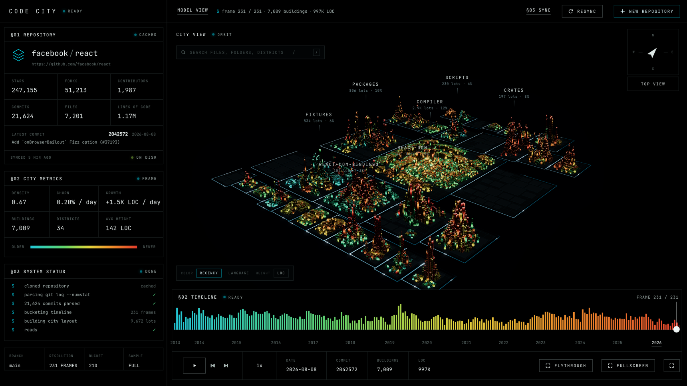
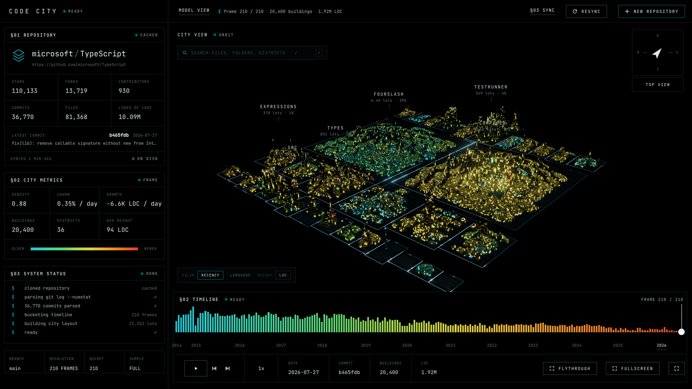
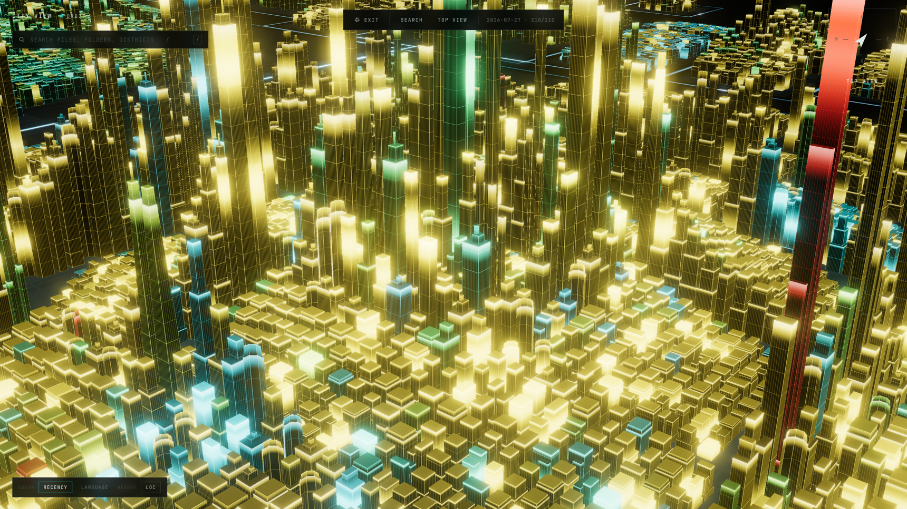
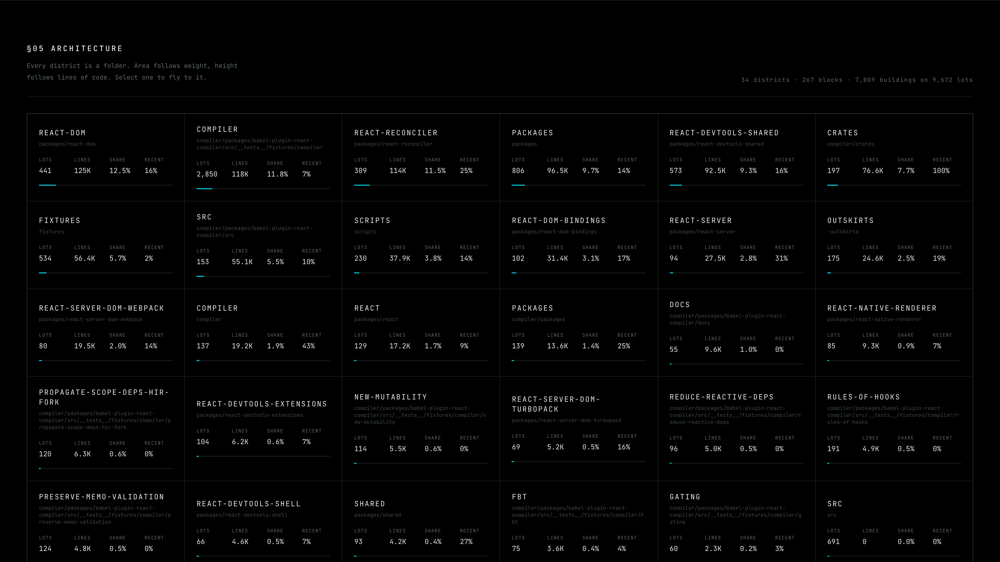
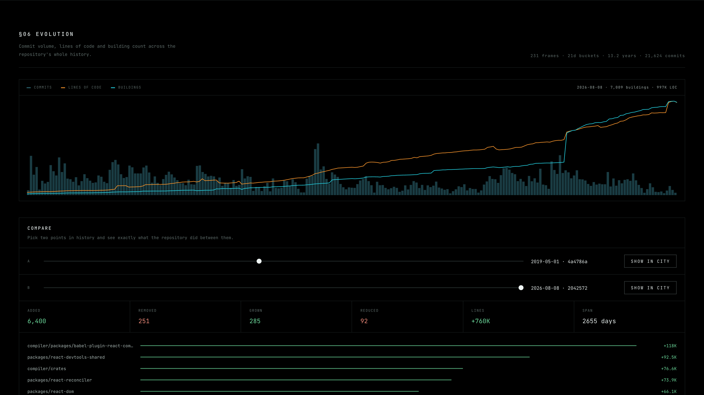
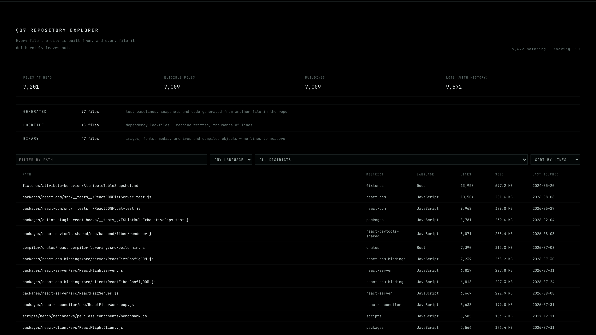
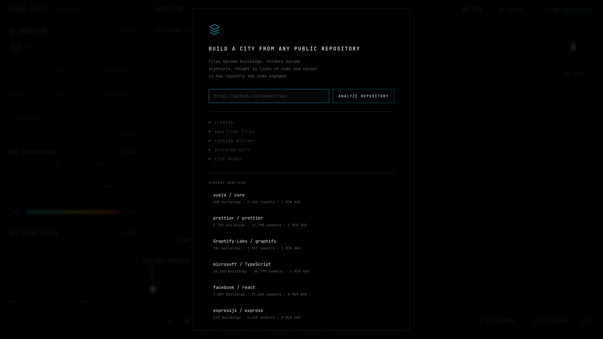

<div align="center">

```
$ CODE CITY
```

**Turn any public git repository into a living 3D city — and explore its architecture and its history.**



</div>

---

Files are buildings. Folders are districts. Height is lines of code. Colour is how
recently the code changed. Paste a repository URL and the city assembles itself
in front of you, then replays the whole git history as a time-lapse.

```bash
bun install
bun run dev          # → http://127.0.0.1:5180
```

Paste a repository URL. That is the whole setup — no account, no token, no
configuration.

---

## The mapping

| The repository | The city |
|---|---|
| a file | one building |
| a folder | a district; large folders split into sub-districts |
| a deeper folder | a block, bounded by streets |
| lines of code | building height, fitted per repository |
| file size on disk | building footprint — so a big file is a tower, not a needle |
| how recently it changed | colour, cyan → red |
| the path | which of 19 architectural archetypes it becomes, deterministically |
| the commit history | the timeline, and the time-lapse |

**The physical size of the city is the size of the repository.** A 130-file Go
router becomes a town of 181 lots. TypeScript becomes 20,400 buildings across
36 districts. Every eligible file gets its own lot — up to 60,000 per
repository, a guard no real repository in testing has come close to; see
[What becomes a building](#what-becomes-a-building).

---

## What it does

- **Paste a URL, get a city.** Clone, analysis and layout run locally, with real
  progress — `CLONING → ANALYZING FILES → PARSING HISTORY → BUILDING CITY → CITY READY`.
- **A holographic construction sequence** the first time a repository is
  analyzed: a ground scan, then blocks, then roads and conduits drawing
  themselves, then the buildings rising, then the city powering on.
- **The whole history as a time-lapse.** Scrub, play at 0.5×–4×, or take the
  scripted flythrough.
- **Search anything** — file, path, folder, district — and fly to it.
- **Inspect any building**: its path, lines, size on disk, when it was last
  touched, which district it belongs to.
- **Three analysis sections** below the city: architecture, evolution with an
  A-vs-B compare, and a file explorer that states exactly which files became
  buildings and which did not.
- **Re-sync** fetches new commits and rebuilds only if HEAD actually moved.



---

## Screenshots

<table>
<tr>
<td width="50%"><br><em>Fullscreen — the city takes the whole viewport</em></td>
<td width="50%"><br><em>Mid-construction: conduits drawing themselves along the avenues</em></td>
</tr>
<tr>
<td><br><em>§05 Architecture — every district with real numbers</em></td>
<td><br><em>§06 Evolution — history, and A-vs-B compare</em></td>
</tr>
<tr>
<td><br><em>§07 Explorer — every file, and every exclusion</em></td>
<td><br><em>The front door</em></td>
</tr>
</table>

---

## Quick start

**Requirements**

- [Bun](https://bun.sh) 1.1+
- `git` on your `PATH`
- A browser with WebGL 2 — any laptop from the last several years

```bash
bun install
bun run dev
```

`bun run dev` starts two things: the ingest API on `:5181` and the viewer on
`:5180`. Open the viewer and paste a repository URL — `owner/repo`,
`https://github.com/owner/repo`, or the same with `.git`. GitLab, Bitbucket and
self-hosted git work too; only the stars/forks readout is GitHub-specific.

**Without the UI**

```bash
bun run bin/codecity.ts facebook/react
bun run bin/codecity.ts owner/repo --resync    # fetch new commits, rebuild if HEAD moved
bun run bin/codecity.ts owner/repo --rebuild   # rebuild from the cached clone
```

Clones live in `data/cache/`, cities in `data/out/`. Both are gitignored; delete
either at any time.

---

## Why it clones instead of calling the GitHub API

Unauthenticated GitHub is capped at 60 requests/hour, and its commits endpoint
will not give per-file line deltas cheaply at any scale. A bare clone plus
`git log --numstat` has no rate limit, is faster, works on any git host, and
works on private repositories you already have local access to.

Exactly **one** GitHub API call is made per ingest — `/repos/{owner}/{repo}`, for
stars and forks. The contributor count is the distinct author count from the
parsed history, so there is no second call and no Link-header paging.

---

## What becomes a building

Every file at HEAD becomes its own building unless it falls into one of these
categories, and §07 names each one with its count:

| Excluded | Why |
|---|---|
| `vendored` | `node_modules`, `vendor`, `third_party`, `Pods`… — code the repo imported, not code it wrote |
| `build-output` | `dist`, `build`, `target`, `.next`, `coverage`… |
| `lockfile` | machine-written, thousands of lines, no authorship |
| `binary` | images, fonts, media, archives, compiled objects — nothing to measure |
| `generated` | `__snapshots__`, `baselines`, `*.min.js`, `*.pb.go`, `*_pb2.py`, source maps |
| `oversized` | a single file over 4 MB is a dataset, not source |

TypeScript is the instructive case: 81,368 files at HEAD, of which **60,933 are
compiler test baselines** — `.types`, `.symbols` and `.baseline` files generated
from the `.ts` sitting next to them. 20,400 files are actually authored, and
20,400 buildings is what the city has.

Deleted files still get plots — that is what lets the time-lapse show a
repository *losing* code — but only if they grew past 60 lines, and together they
never take more than ~38% of the city.

Above 60,000 lots a repository stops fitting one-file-one-building exactly: the
largest folders start collapsing their smallest files into a single aggregate
lot, sized by their combined weight, so the layout stays readable instead of
becoming 60,000 one-pixel slivers. Raise the ceiling with `--max-buildings`. No
repository in testing — TypeScript included, at 21,352 lots — has come near it;
`meta.sampled` is `false` unless this guard actually fired.

Two words are used precisely throughout the UI:

- **LOTS** — every plot the city reserves, history included.
- **BUILDINGS** — the lots standing in the frame currently on screen.

---

## Controls

| | |
|---|---|
| drag | orbit |
| right-drag | pan |
| wheel | zoom, toward the cursor |
| click a building | open the §04 inspector |
| `/` | search files, folders and districts; `enter` flies there |
| drag the timeline | scrub to any frame |
| `space` | play / pause |
| `←` `→` (`shift` = ×10) | step one frame |
| `home` / `end` | first / last frame |
| `f` | scripted flythrough |
| FULLSCREEN | the city takes the whole viewport; `esc` exits |
| `esc` | close search, leave fullscreen, clear selection |

The camera drifts very slowly when idle and stops the moment you touch it.

---

## How it works

```
git clone --bare
  → git ls-tree -r -l HEAD      every file and its size
  → git log --all --numstat     every per-file line delta, streamed
  → replay into ≤240 frames     adaptive calendar buckets
  → districts → blocks → lots   deterministic layout
  → one JSON per repository     served to the viewer
```

**Ingest** ([`ingest/`](ingest/)) streams the log rather than buffering it —
TypeScript emits several million numstat lines. The tree census at HEAD is the
authority on what the repository *is*, in both directions: a file that only ever
existed on an unmerged branch is history, and a file the log never gave a line
count for still stands.

**Layout** ([`ingest/build-layout.ts`](ingest/build-layout.ts)) turns the folder
tree into `districts → blocks → lots`. Blocks and districts are placed by a shelf
packer laid out from the middle outward, so the heaviest folders end up downtown
and the gaps it leaves *are* the streets. A folder over ~1,100 buildings splits
into sub-districts recursively, which is how a monorepo grows real neighbourhoods
instead of one enormous slab.

**Rendering** ([`viewer/src/scene/`](viewer/src/scene/)) is 19 procedural
architectural archetypes — podium-and-tower, stepped setbacks, tapered and
chamfered towers, crowns, rooftop plant, buttressed cores, spires, low-rise
slabs — batched as one `InstancedMesh` per archetype variant, all sharing a
single `ShaderMaterial`. No models are downloaded, no textures are used, and no
building gets its own mesh. Archetype, rotation and proportions come from an
FNV-1a hash of the file path, so the same file is always the same building.

The shader keeps building bodies near black and draws everything that reads as
architecture as lines on them — floor bands, vertical mullions, corner edges,
volume trims, crowns — with a distance LOD that drops the per-storey work at
exactly the distance where a floor band stops being a pixel wide. One expanding
pulse uniform is shared by the buildings, the ground and the conduits, which is
what makes the districts read as one powered system rather than a thousand
independently blinking objects.

**Determinism.** The same commit always produces the same city: paths are sorted
before the tree is built, every sort has an explicit final tie-break on the path
itself, and nothing depends on Map iteration order.
[`tools/validate.ts`](tools/validate.ts) proves it by fingerprinting a rebuild.

**The data contract.** Every dataset carries a schema version and passes through
[`ingest/schema.ts`](ingest/schema.ts) before it can reach the renderer. A city
written by an older layout is refused with a message and a rebuild button, not a
stack trace.

---

## Performance

Measured on an M-series MacBook at 1672 × 941, Chrome:

| City | Lots | Idle | Orbit | Zoom | 4× playback | Fullscreen | Pick |
|---|---|---|---|---|---|---|---|
| `microsoft/TypeScript` | 21,352 | 60 | 60 | 60 | 60 | 60 | 0.06 ms |
| synthetic stress | 30,000 | 60 | 60 | 60 | 60 | 60 | 0.21 ms |
| synthetic stress | 50,000 | 60 | 60 | 61 | 59 | 61 | 0.15 ms |

All figures are frames per second. The construction sequence briefly runs around
40 fps on a 50,000-lot city while every instance is written for the first time;
the steady state is 60.

What keeps it there: one shared material, one `InstancedMesh` per archetype,
height carried in an instanced attribute so a frame change rewrites one float per
building instead of a matrix, delta frame updates that recolour only the
buildings a frame actually changed, and a fragment-side distance LOD. Picking is
an explicit ray/AABB slab test against each building's real lot, because the
geometry is not a box and its height lives in a shader attribute.

```bash
bun run tools/stress.ts 50000        # generate a synthetic 50k-lot city
```

---

## Testing

```bash
bun run typecheck               # tsc --noEmit
bun run tools/validate.ts       # layout structure, determinism, picking
bun run tools/smoke.ts          # 17 interaction checks in a real browser
bun run tools/cold-test.ts      # 10 never-before-analyzed repositories, end to end
```

`cold-test` deletes each repository's clone and dataset first, then drives the
actual UI: paste, analyze, verify the city, search, pick, scrub, fullscreen,
every section, and reopen from cache. It asserts the thing that matters most —
**standing buildings must equal eligible files at HEAD**.

It currently passes on `sindresorhus/is-plain-obj`, `vercel/ms`,
`github/gitignore`, `spf13/cobra`, `psf/requests`, `d3/d3`, `clap-rs/clap`,
`google/gson`, `withastro/astro` and `mrdoob/three.js` — chosen for structural
variety, including one repository with no source code in it at all.

`?still=1` freezes the camera drift and the construction animation, which is what
makes screenshots reproducible.

---

## Limitations

- **Clones are full-history by default.** A large repository takes as long as
  `git clone` takes. There is a `--depth` flag, but on very large repos a shallow
  clone can be *slower and bigger* than a full one, because the server cannot
  reuse its on-disk deltas.
- **Renames are delete + add.** `--no-renames` keeps the parser to one line format
  and makes the time-lapse read correctly, at the cost of rename tracking.
- **One repository at a time.** No cross-repository comparison.
- **Private repositories** work from the CLI if you already have local git access;
  the browser flow does not do authentication.
- **Desktop only.** The layout targets a wide viewport; there is no mobile mode.
- **Video export is not built.** The flythrough exists; capturing it does not.

---

## Project layout

```
ingest/     clone, census, log parsing, bucketing, layout, eligibility, schema
server/     the local API — analyze, progress stream, dataset serving
viewer/     the browser app: scene, shaders, HUD, timeline, sections
tools/      dev runner, screenshots, validation, smoke, cold test, stress
data/       clones and generated cities (gitignored)
```

---

## Acknowledgements

The core idea — a repository as a city, files as buildings — comes from Richard
Wettel and Michele Lanza's **CodeCity** (2008). This is an independent take on
it: procedural architecture, a real time-lapse of git history, and a
paste-a-URL-and-look-at-it workflow.

Built with [three.js](https://threejs.org), [Vite](https://vitejs.dev) and
[Bun](https://bun.sh). Typeface is [JetBrains Mono](https://www.jetbrains.com/lp/mono/).

## License

MIT — see [LICENSE](LICENSE).
